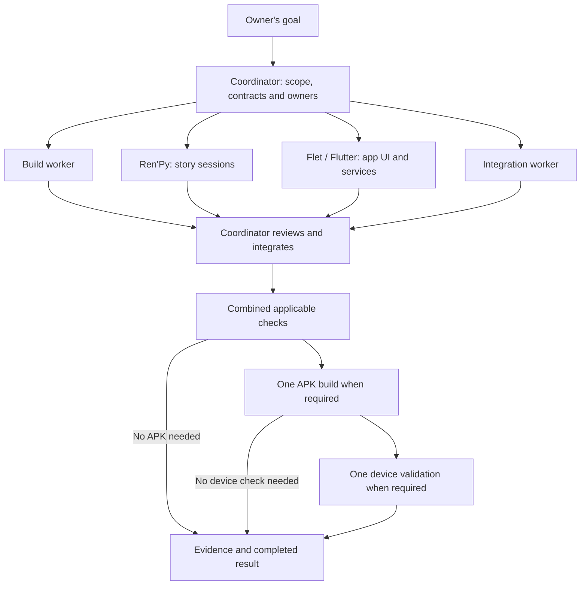

# Parallel development

The coordinator accepts one goal and assigns up to four independent jobs.
Workers handle bounded deliverables; the coordinator owns shared decisions,
integration and the final result. This uses the existing agent delegation,
Git worktrees and CI, without a new scheduler service.

## Product direction

The owner selected **general-purpose Android apps with story features** and
explicitly asked to preserve the working setup. Add reusable app screens,
forms, data and supported device-service recipes to the existing integration.
For a project that needs an app-first interface, provide an opt-in Flet/Flutter
template with Ren'Py story features. Ren'Py/SDL continues to own startup and
the single Python interpreter in the existing host.

Keep **Before the First Light**, its story-first entry point, shared menus,
interlude/save behavior and SDK branch arrangement working. An app home or
story entry/resume/return recipe is optional application work, not a new default
or a replacement runtime. Use one active story at a time when adding that recipe.
Application records/settings stay independent of story bookmarks; loading a
story must not restore older app data or hijack an unrelated app route.

Use additive changes and existing APIs. Include regression evidence for affected
current behavior. Do not turn the product direction into an engine migration,
default navigation change or broad refactor. SDK preservation is part of every
task's acceptance conditions.



Not every task needs an APK or a device. Documentation and isolated workflow
path changes can finish after their appropriate review. Work that changes app
inputs needs a new artifact; SDK/native/bridge/save changes need the broad
applicable integration checks. See [agent checks](agent-checks.md).

## Four lanes

| Lane | Useful jobs | Typical ownership |
| --- | --- | --- |
| Build | Content-keyed Flutter AAR reuse, phase timings, one-ABI development packaging | `build_android.py`, `prepare.py`, build/cache workflows, dedicated build tests |
| Ren'Py | Story entry/resume/return, native authoring, save-slot browsing, preferences, saveable activity state | `game/`, `runtime/renfletpy.py`, `runtime/tactics.py`, assigned state tests |
| Flet/Flutter | App home/navigation, forms, application data, editor/table screens, media and existing device services | Dedicated top-level `runtime/<feature>.py`, `runtime/story_ui.py` when assigned, dedicated assets/tests |
| Integration | Capability acceptance fixtures, protocol/output probes, artifact and device regression | Assigned `scripts/check_*`, device/media harnesses, dedicated regression tests and evidence |

Reserve `runtime/sdk_bridge.py`, `RunnerActivity.java`, `sdk-lock.json`, the
extension catalog, `flutter/pubspec.yaml`, `flutter/pubspec.lock` and
`flutter/lib/extensions.dart` for one named owner per batch. Other workers send
narrow dependency requests to that owner. Test files also get exactly one writer.

The current integration boundary stays: Ren'Py owns story flow and native saves;
Flet owns rich screens and service UI, including optional app interfaces.
Cross-boundary values are plain commands,
results and saveable state. A feature supported by either system should use that
system's existing API. Flet exposes only part of Flutter; new Dart capabilities
need deliberate registration/packaging work rather than an assumed Python API.

## Start a batch

1. Record the base revision, requested behavior, intentional exceptions and
   acceptance conditions. Camera stays disabled and player rollback stays removed.
2. Write small task packets using the template below. Assign file ownership and
   agree shared API/state contracts before implementing dependent code.
3. Use separate worktrees and writable caches for code workers. Start independent
   jobs immediately. UI workers may use an agreed fixture while native handlers
   are implemented; their final validation depends on the real handler.
4. Workers return concrete diffs, results and blockers. Split a job when it grows
   into a separate SDK change, host change or save migration.
5. Integrate main-derived task changes, review the combined result, and perform
   the applicable checks/build/device run against that one revision. Component
   branches travel through verified archives and pins, not branch merges.

The coordinator runs delegation while the session is active. This guide does
not install an unattended agent service; repository CI runs on its configured
events. The owner should not have to assign each worker or reconcile their code.

## Task packet

```text
Goal and observable result:
Base revision:
Owned files (one writer per file):
Dependencies / command-result-state contract:
Preserved behavior and intentional exceptions:
Fast checks during implementation:
Completion checks and hardware prerequisites:
Done evidence: diff, actual results, skipped checks and remaining blockers
```

Use one feature or one optimization per packet. Tests should verify a real
behavior or failure risk, not repeat implementation details. Escalate a blocker
when found; do not spend an entire session expanding a small request silently.

## Current implementation and following batches

The integration now reuses verified Flutter AAR output and provides the optional
app starter, persistent records and native story recipe within the existing
setup. The implemented [session contract](app-session.md) and
[native recipe](app-story.md) cover Start/Resume/Return, completion and isolated
recovery. The default remains the working story sample. The first batch's lane
contracts were:

| Worker | Bounded deliverable | Dependencies and done condition |
| --- | --- | --- |
| Build | Reuse the complete validated Flutter Maven/AAR output when its inputs are unchanged | Key actual Dart/plugin/SDK/build inputs, reject incomplete output, retain force rebuild; demonstrate cold/warm and Python-only-change behavior |
| Ren'Py | Copyable native story/input/choice examples and a saveable result handoff for a selected recipe | Reuse existing labels/native saves; preserve the default story, pending choices, native state and old-save recovery |
| Flet/Flutter | Optional form/list/settings recipe with persistent app data; opt-in app home only when selected | Use pinned Flet APIs and the agreed handoff; preserve existing routes and keep app data separate from story saves |
| Integration | Existing-behavior regression and recipe persistence/navigation fixtures | Define acceptance in parallel; verify current demo/save/recovery behavior and new results; final device checks use the combined APK |

For a following app-first recipe, reuse the implemented commands, story identity,
completion result and navigation/Back behavior, or agree an explicit bounded
extension before dependent code starts. Native Cancel, richer screens and
standalone caller-return semantics remain follow-ups recorded in the
[starter plan](app-starter-plan.md#earlier-proposals-and-retained-follow-ups).
Add one concrete service or screen at a time using existing APIs rather than
building a universal activity framework.

Save-slot browsing is a useful following batch: the Ren'Py worker supplies native
slot commands/plain listings, the Flet worker supplies controls against the agreed
schema, and the integration worker tests older saves and recovery. Shared routing
and command completion have one owner. This does not require a new save engine.

## Capability scope

Use [Ren'Py authoring](renfletpy.md),
[Flet/Flutter capability status](flet-flutter-capabilities.md) and
[recorded validation](validation.md) to distinguish what is retained, usable,
exposed by the sample and actually verified. The aim is broad supported capability
with reusable authoring and service recipes, not a blanket claim of every upstream
operation on every device. Physical hardware, production IDs, assets and native
dependencies remain explicit prerequisites for the features that need them.

The first parallel repository pass added these working rules, the check runbook
and capability guidance. It also corrected the runtime cache path to include
content-addressed Flet SDK installations. Flutter AAR reuse and additional feature
recipes were proposed jobs in that pass. Later batches implemented verified AAR
reuse, reusable records and the optional starter, with native and Android
acceptance recorded in [validation](validation.md) and
[starter acceptance](app-starter-acceptance.md). Follow-on work preserves the
existing setup, default sample and approved runtime ownership.
